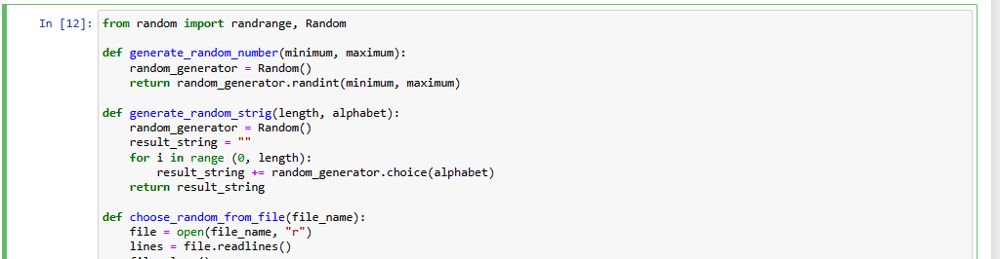

# Random Data Generator

This is a simple program for data generation.

## Description

Contains multiple functions for random data creation, like strings, numbers in range or addresses.

## Getting Started

### Dependencies

* Anaconda or Jupyter Notebook installed

### Installing

* For the initial start we must install [pandas](https://pandas.pydata.org/) an [matplotlib](https://matplotlib.org/). Coverage is optional.

```
python -m pip install wheel
python -m pip install pandas
python -m pip install matplotlib
python -m pip install coverage
```

### Executing program

* Open the Jupyer Notebook [file](/random-data-generator.ipynb)
* Execute the functions dependencies 



# Test Coverage


## Authors

Contributors names and contact info

- [alejovasquero](https://github.com/alejovasquero)

## Version History

* 1.0
    * Initial version

## License

This project is licensed under the GPL GNU License - see the [LICENSE.md](/LICENSE) file for details

## Acknowledgments
